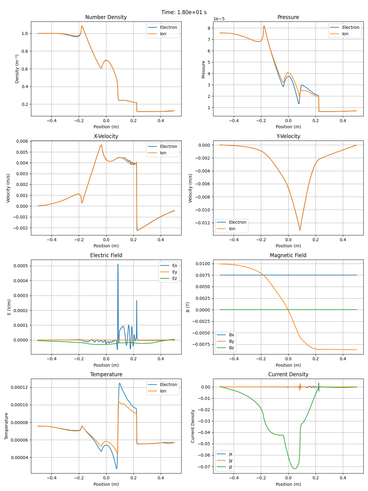

# Two-Fluid Plasma Model Simulation

**Note: This code is functional but experimental. The code structure may be improved in future updates.**

This repository contains a PyTorch implementation of a two-fluid plasma model based on the paper ["Approximate Riemann solver for the two-fluid plasma model"](https://www.aa.washington.edu/sites/aa/files/research/cpdlab/docs/Shumlak_JCP2003.pdf) by Uri Shumlak et al.

The code was completely AI-generated with human assistance through Windsurf IDE and Claude 3.5 Sonnet.

## Features

- Separate conservation equations for electron and ion fluids
- Full Maxwell's equations
- GPU-accelerated using PyTorch
- Second-order spatial reconstruction with minmod limiter
- TVD Runge-Kutta time integration
- Configurable charge parameters
- Shock-capturing capability

## Installation

This project uses Poetry for dependency management. To install:

```bash
poetry install
```

## Usage

Run the shock simulation with default parameters:

```bash
poetry run python shock_simulation.py
```

Configure simulation parameters:

```bash
poetry run python shock_simulation.py --resolution 500 --final-time 0.2 --plot-interval 0.01 --charge 10.0
```

Options:
- `--resolution, -r`: Number of spatial grid points (default: 500)
- `--final-time, -t`: Final simulation time (default: 0.2)
- `--plot-interval, -p`: Time between plots (default: 0.01)
- `--charge, -c`: Magnitude of species charge (ion: +charge, electron: -charge) (default: 10.0)

## Development History

The complete development conversation between the human developer and Claude 3.5 Sonnet is available in [TRANSCRIPT.md](TRANSCRIPT.md). This transcript shows the iterative process of implementing the model, debugging issues, and making improvements.

## Latest Simulation Results



The image shows the final state of the simulation with:
- Density profiles for electrons and ions
- Velocity components
- Electric and magnetic field components
- Temperature evolution

## Implementation Details

The simulation uses normalized units where:
- Ion mass = 1.0
- Speed of light = 1.0
- μ₀ = 1.0, ε₀ = 1.0
- Configurable charge parameter (default: qi = +10, qe = -10)

Initial conditions are based on a modified Brio-Wu shock setup with:
- Density discontinuity (1.0 vs 0.125)
- Pressure discontinuity (0.5 vs 0.05)
- Magnetic field discontinuity
- Zero initial velocities
